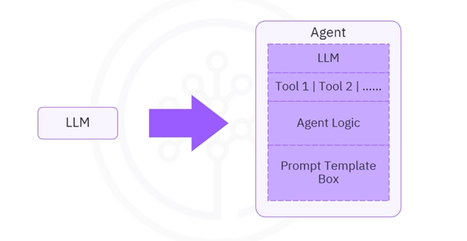

# 🛠️ Popular Built-in Tools in LangChain

⏱️ **Estimated Reading Time:** 5 Minutes

LangChain offers a variety of built-in tools designed to enhance AI agent capabilities across search, coding, web browsing, productivity, and more. These tools work seamlessly with language models, allowing for **dynamic task execution**. 

---

## 🎯 Learning Objectives
In this guide, you will:
* **Identify** key built-in tools and toolkits available in LangChain.
* **Understand** the purpose and function of each tool category.
* **Compare** search and data analysis tools for ideal applications.
* **Evaluate** accessibility (Free vs. Paid) based on official documentation.

---

## 🏗️ Tools vs. Toolkits

> [!IMPORTANT]  
> **Tools:** Utilities designed to be called by a model. Their inputs are generated by the LLM, and their outputs are passed back to the LLM.  
> **Toolkit:** A curated collection of tools meant to be used together for a specific domain (e.g., Gmail, SQL).

> [!WARNING]  
> **Pricing:** Some tools require API keys and payment. Always verify current pricing on the [Official LangChain Documentation](https://python.langchain.com/docs/integrations/tools/).

---

## 🗂️ Tools by Use Case

### 🔍 Search Tools
| Tool / Toolkit | Function | Purpose |
| :--- | :--- | :--- |
| **SerpAPI** | Web search | Performs web searches and returns structured answers. |
| **Google Search** | Web search | Returns URLs, snippets, and titles from Google. |
| **Tavily Search** | AI-optimized search | Built specifically for AI agents; returns high-quality content & images. |
| **Wikipedia** | Knowledge base | Searches articles and returns relevant summaries. |

### 🐍 Code & Data Analysis
| Tool / Toolkit | Function | Purpose |
| :--- | :--- | :--- |
| **Python REPL** | Code execution | Executes Python code for complex math and automation. |
| **Pandas DataFrame** | Data manipulation | Allows agents to interact with tabular data. |
| **SQL Database** | Database querying | Query and manipulate SQL databases using natural language. |
| **LLMMathChain** | Mathematics | Solves word problems by translating them into Python code. |
| **JSON Toolkit** | JSON manipulation | Efficiently interacts with large JSON/dictionary objects. |

### 🌐 Web Browsing & Interaction
| Tool / Toolkit | Function | Purpose |
| :--- | :--- | :--- |
| **Requests Toolkit** | HTTP requests | Interacts with web APIs and fetches raw content. |
| **PlayWright** | Browser automation | Controls browsers to navigate and click on web pages. |
| **MultiOn** | Web app interaction | Enables interaction with popular web applications. |
| **ArXiv** | Scientific search | Retrieves academic papers from the arXiv repository. |

### 📅 Productivity & Collaboration
| Tool / Toolkit | Function | Purpose |
| :--- | :--- | :--- |
| **Gmail Toolkit** | Email management | Reading, sending, and managing emails. |
| **Office365** | Suite integration | Interacts with Outlook, OneDrive, and Word. |
| **Slack Toolkit** | Communication | Sends and reads messages in channels or DMs. |
| **GitHub Toolkit** | Repo management | Manages issues, PRs, and repository settings. |
| **Google Calendar** | Calendar management | Creates and updates calendar events. |

### 📁 File & Document Processing
| Tool / Toolkit | Function | Purpose |
| :--- | :--- | :--- |
| **File System** | Local operations | Reads, writes, and manages files on your machine. |
| **Google Drive** | Cloud storage | Accesses and searches files in the Google cloud. |
| **VectorStoreQA** | Document querying | Searches information within vector databases. |
| **Doc Loaders** | Content extraction | Extracts text from PDFs, DOCX, and more. |

### 💰 Finance & Business
| Tool / Toolkit | Function | Purpose |
| :--- | :--- | :--- |
| **Yahoo Finance** | Market news | Retrieves financial news and market info. |
| **GOAT** | Transactions | Handles payments, purchases, and investments. |
| **Polygon IO** | Market data | Real-time and historical data for stocks and options. |
| **Stripe** | Payment processing | Manages e-commerce functions and subscriptions. |

### 🤖 AI & Machine Learning
| Tool / Toolkit | Function | Purpose |
| :--- | :--- | :--- |
| **Dall-E** | Image generation | Creates images from text via OpenAI. |
| **HuggingFace** | Model access | Connects to thousands of hosted ML models. |
| **Google Imagen** | Image generation | Accesses Google's Vertex AI image capabilities. |
| **Nuclia** | Data indexing | Indexes unstructured data for enhanced retrieval. |

---

## 📝 Summary
* **Extensibility:** Tools extend LLMs into the real world (Web, Files, APIs).
* **Orchestration:** Toolkits simplify complex tasks by grouping related utilities.
* **Strategic Choice:** Choose tools based on the specific need (e.g., **Tavily** for AI search vs. **Wikipedia** for facts).
* **Due Diligence:** Always check the official documentation for the latest API costs and availability.